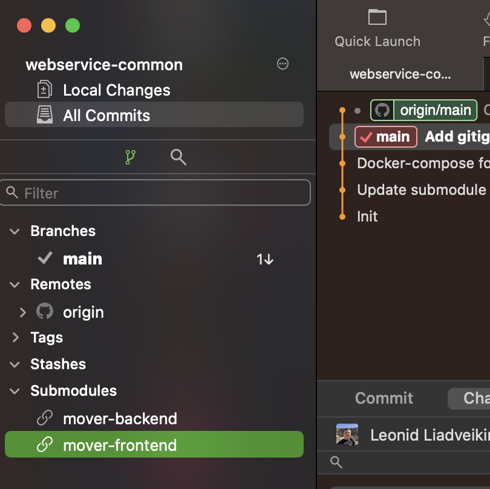

# WebService common

Repo for frontend and backend.

Install submodules before launch:

```
git submodule update --init --recursive
```

Do not forget to update commits of git submodules to point out most recent changes:

### In Fork

1. Click on submodule in the project navigator on the left side
2. Choose a commit
3. Commit changes in the root repo.



## Launch

```
docker-compose build

docker-compose down (add -v to wipe db) // optional to shutdown old containers

docker-compose up

docker-compose run migrate // optional to run db migrations (create tables)
```
